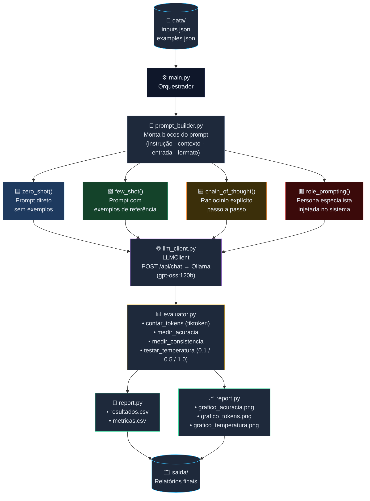

# Prompt Toolkit

### Avaliação de Técnicas de Prompting com LLMs Locais

---

|                 |                                                                                                                                                        |
| --------------- | ------------------------------------------------------------------------------------------------------------------------------------------------------ |
| **Grupo**       | `LevelUP`                                                                                                                                              |
| **Integrantes** | `Gabriel Lima da Silva - 568436` · `Luiz Gustavo de Almeida — 566613]` · `João Carmo Cassu de Castro — 567030` · `Nicolas Araujo de Oliveira - 566780` |
| **Data**        | `2026`                                                                                                                                                 |

---

## 1. Domínio e Problema

### Por que E-commerce?

O setor de e-commerce brasileiro é um dos maiores geradores de interações textuais não estruturadas no país. Avaliações de produtos, mensagens de suporte, solicitações de devolução e descrições de catálogo produzem diariamente milhões de registros que precisam ser classificados, interpretados e respondidos com precisão e velocidade.

Três problemas recorrentes motivaram a escolha do domínio:

**1. Volume de avaliações sem triagem.** Marketplaces recebem centenas de avaliações por hora. Sem classificação automática de sentimento, equipes de CX não conseguem priorizar casos críticos (fraudes, produtos defeituosos, clientes em churn) a tempo de reverter a situação.

**2. Extração manual de dados de suporte.** Mensagens de clientes sobre pedidos chegam em linguagem natural e exigem que atendentes copiem manualmente número de pedido, data, valor e intenção para dentro do CRM — processo lento e propenso a erros.

**3. Inconsistência nas descrições de produtos.** Lojistas parceiros publicam descrições de qualidade variável, prejudicando conversão e SEO. A geração automática padroniza tom, estrutura e apelo persuasivo.

### O que o Toolkit resolve

O Prompt Toolkit testa sistematicamente qual técnica de prompting (Zero-Shot, Few-Shot, Chain-of-Thought ou Role Prompting) entrega o melhor equilíbrio entre **acurácia**, **custo em tokens** e **consistência** para cada uma dessas três tarefas — fornecendo evidência empírica para decisões de produção.

---

## 2. Arquitetura e Fluxo

### Fluxo do Sistema



### Responsabilidade de cada módulo

| Módulo              | Responsabilidade                                                                                             |
| ------------------- | ------------------------------------------------------------------------------------------------------------ |
| `main.py`           | Carrega config, itera tarefas × entradas × técnicas, coordena avaliação e relatório                          |
| `prompt_builder.py` | Funções puras que montam seções do prompt (`instrução`, `contexto`, `entrada`, `exemplos`, `CoT`, `formato`) |
| `techniques.py`     | Compõe o prompt final aplicando a técnica solicitada; devolve o resultado do LLM                             |
| `llm_client.py`     | Encapsula o POST ao Ollama; retorna `resposta`, `tokens_prompt`, `tokens_resposta`, `tempo_s`                |
| `tasks.py`          | Dicionário com instrução, contexto, formato de saída e passos de raciocínio para cada tarefa                 |
| `evaluator.py`      | Métricas de qualidade e custo; isoladas do orquestrador para facilitar testes unitários                      |
| `report.py`         | Persistência em CSV e renderização de gráficos; tema escuro com `matplotlib.rcParams`                        |

---

## 3. Stack Técnica

### Dependências

| Biblioteca       | Versão mínima  | Uso no projeto                                                          |
| ---------------- | -------------- | ----------------------------------------------------------------------- |
| **Python**       | 3.10+          | Tipagem com `X \| Y`, `match/case` implícito, f-strings avançadas       |
| **Ollama**       | Última estável | Servidor LLM local; endpoint `POST /api/chat` com `stream: false`       |
| **gpt-oss:120b** | —              | Modelo de linguagem; temperatura configurável por chamada               |
| **requests**     | 2.31+          | Cliente HTTP para o Ollama; tratamento de `ConnectionError` e `Timeout` |
| **tiktoken**     | 0.7+           | Contagem de tokens com encoder `cl100k_base`; fallback por palavras     |
| **pandas**       | 2.2+           | Agregação de resultados e exportação em CSV com `utf-8-sig`             |
| **matplotlib**   | 3.9+           | Três gráficos PNG com tema escuro e eixo duplo para temperatura         |

### Comandos de instalação

```bash
# Ambiente virtual
python -m venv .venv && source .venv/bin/activate

# Dependências
pip install -r requirements.txt

# Ollama (servidor e modelo)
ollama serve
ollama pull gpt-oss:120b

# Execução
python main.py
```

### Variáveis de ambiente (`.env`)

```dotenv
OLLAMA_HOST=http://localhost:11434
OLLAMA_MODEL=gpt-oss:120b
OLLAMA_TIMEOUT=120
```

---

## 4. Resultados

> ⚠️ **Instrução ao grupo:** substitua os valores de exemplo abaixo pelos resultados reais gerados em `saida/metricas.csv` e `saida/resultados.csv` após executar `python main.py`.

### 4.1 Tabela Comparativa — Acurácia e Custo por Técnica

| Técnica          | Classificação (Acurácia) | Extração (Acurácia) | Geração | Tokens Médios (Prompt) | Tokens Médios (Resposta) | Tempo Médio (s) |
| ---------------- | ------------------------ | ------------------- | ------- | ---------------------- | ------------------------ | --------------- |
| Zero-Shot        | `[0.xx]`                 | `[0.xx]`            | —       | `[000]`                | `[000]`                  | `[0.0]`         |
| Few-Shot         | `[0.xx]`                 | `[0.xx]`            | —       | `[000]`                | `[000]`                  | `[0.0]`         |
| Chain-of-Thought | `[0.xx]`                 | `[0.xx]`            | —       | `[000]`                | `[000]`                  | `[0.0]`         |
| Role Prompting   | `[0.xx]`                 | `[0.xx]`            | —       | `[000]`                | `[000]`                  | `[0.0]`         |

_Geração avaliada qualitativamente (sem gabarito numérico)._

### 4.2 Teste de Temperatura

| Temperatura | Tokens de Resposta (média) | Tempo (s) | Observação                              |
| ----------- | -------------------------- | --------- | --------------------------------------- |
| 0.1         | `[000]`                    | `[0.0]`   | Respostas mais determinísticas e curtas |
| 0.5         | `[000]`                    | `[0.0]`   | Equilíbrio entre variação e coerência   |
| 1.0         | `[000]`                    | `[0.0]`   | Maior criatividade; risco de alucinação |

### 4.3 Gráficos Gerados

> 📌 **Inserir abaixo as imagens geradas na pasta `saida/`:**

**Gráfico 1 — Acurácia por Tarefa e Técnica**

```
[Inserir: saida/grafico_acuracia.png]
Barras agrupadas comparando Zero-Shot, Few-Shot, CoT e Role Prompting
nas tarefas de Classificação e Extração.
```

**Gráfico 2 — Custo Médio em Tokens por Técnica**

```
[Inserir: saida/grafico_tokens.png]
Barras empilhadas com tokens de prompt vs. resposta por técnica.
Evidencia o trade-off entre qualidade e custo computacional.
```

**Gráfico 3 — Impacto da Temperatura**

```
[Inserir: saida/grafico_temperatura.png]
Linha dupla: tokens de resposta (eixo esquerdo) e tempo em segundos
(eixo direito) para temperaturas 0.1, 0.5 e 1.0.
```

---

## 5. Guia de Bolso — Quando Usar Cada Técnica

> Referência rápida para aplicações de e-commerce com LLMs.

| Técnica              | Use quando…                                                                                                                           | Exemplo no domínio                                                                                                          | Cuidado                                                                                                           |
| -------------------- | ------------------------------------------------------------------------------------------------------------------------------------- | --------------------------------------------------------------------------------------------------------------------------- | ----------------------------------------------------------------------------------------------------------------- |
| **Zero-Shot**        | A tarefa é simples, bem definida e o modelo tem conhecimento suficiente sem exemplos. Prioridade: baixo custo e latência mínima.      | Classificar sentimento de avaliações de 1 a 5 estrelas em POSITIVO / NEGATIVO / NEUTRO.                                     | Acurácia cai em tarefas ambíguas ou com terminologia muito específica do negócio.                                 |
| **Few-Shot**         | Há padrões específicos de saída que o modelo precisa aprender por imersão. O formato esperado é rígido (ex.: JSON com campos exatos). | Extrair `numero_pedido`, `data_compra`, `valor` e `intencao` de mensagens de suporte em formatos variados.                  | Aumenta o custo de tokens; exemplos ruins degradam a saída. Manter banco de exemplos atualizado.                  |
| **Chain-of-Thought** | A tarefa exige raciocínio em múltiplas etapas ou há risco de o modelo "pular" critérios importantes. Qualidade > velocidade.          | Analisar se uma reclamação deve gerar estorno, troca ou apenas resposta — ponderando política, histórico e valor do pedido. | Tokens de resposta aumentam significativamente. Não indicado para pipelines de alta frequência.                   |
| **Role Prompting**   | O estilo, tom e vocabulário da saída são críticos. A persona especialista eleva a qualidade percebida sem exigir exemplos explícitos. | Gerar descrições de produto persuasivas com tom de marca, CTA e gatilhos emocionais adequados ao público-alvo.              | Depende de personas bem redigidas em `system_prompts.json`. Testar diferentes personas para cada tipo de produto. |

---

## 6. Reflexão do Grupo

> ⚠️ **Instrução ao grupo:** preencha as seções abaixo com base na experiência real de execução do toolkit.

### O que surpreendeu

```
[Descreva aqui um resultado inesperado observado durante os experimentos.
Exemplos de tópicos para abordar:
- Uma técnica que performou melhor ou pior do que o esperado.
- Comportamento do modelo com temperatura alta na tarefa de extração.
- Diferença de latência entre técnicas mais verbosas (CoT) e diretas (Zero-Shot).
- Como a qualidade dos exemplos few-shot afetou a acurácia de extração.]
```

### Técnica vencedora e justificativa

```
[Indique qual técnica obteve o melhor desempenho geral considerando o
trade-off entre acurácia, custo em tokens e tempo de resposta.
Justifique com base nos dados da tabela comparativa da Seção 4.

Estrutura sugerida:
"A técnica [X] obteve acurácia de [Y]% na tarefa de [Z] com custo médio
de [N] tokens, superando as demais por [motivo]. Para a tarefa de geração,
[Role Prompting / outra] produziu as descrições avaliadas como mais
persuasivas, pois [justificativa]."]
```

### O que faríamos diferente

```
[Reflita sobre melhorias no design do experimento. Sugestões de tópicos:
- Aumentar o número de entradas por tarefa para maior significância estatística.
- Implementar avaliação automática de geração (ex.: BLEU, ROUGE ou LLM-as-judge).
- Testar variações de prompt dentro da mesma técnica (prompt sensitivity).
- Adicionar cache de respostas para reduzir custo em re-execuções.
- Separar avaliação humana da automática para a tarefa de geração.]
```

---

_Documento gerado a partir do código em `main.py` — Prompt Toolkit v1.0_
